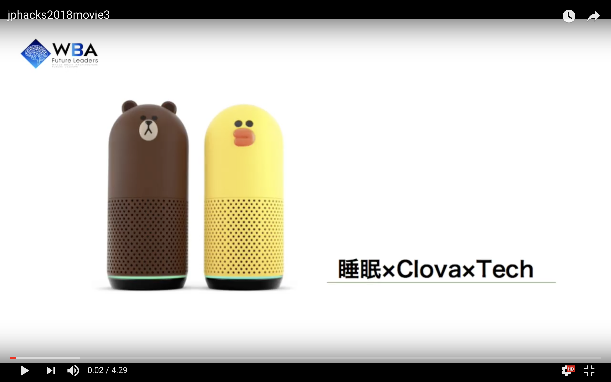

# Sleep Hack

## 製品概要
### 睡眠×Clova×Technology

### 背景
## 「ベットに入ったけど中々寝られない．もっとすっきり長い時間眠りたい！！」

誰もが一度はこんなことを思ったことがあるのではないでしょうか． 
食事,運動と共に「健康の三大要素」に挙げられ，心身の健康に重要な役割を果たしている「睡眠」. 
睡眠不足は生活や仕事の質の低下だけでなく，うつ病やがん，認知症などの病気にかかるリスクの上昇，寿命の減少などの効果があることが研究により判明しており，アメリカの睡眠不足による経済損失は4110億ドルに達するという報告もされています． 
具体的な例を挙げると，2004年のLockley氏らの論文[1]では，研修医たちの労働時間を短縮したことで彼らの睡眠時間が増加したという報告がなされていますが，その結果として夜勤時の不注意によるミスが半減したとも報告されています．この事実は医師の睡眠不足が医療ミスを増加させるということを意味しており，睡眠に関わる問題が社会の中で患者の命という重大な問題につながるということを示唆しています．このように，睡眠に関わる問題は社会的に解決されるべき問題なのです． 
こういった睡眠による問題，悩みを科学の力で解決したいと思い当プロジェクトは始まりました． 
「2分でアメリカ軍の96%の兵士が寝落ちした方法」など，いくつかの文献からの睡眠のアドバイスを，音声によって行うスマートスピーカーのスキルを開発しました．スマートフォンのブルーライドを浴びることなく，ベットに横たわったまま音声によって操作できるので，快適に睡眠を導入できることが可能です． 
また，寝落ちを促進する行為と逆の動作をすることで，起きていたい時に居眠りを防止するスキルも開発しました． 
遅くまで開発したい，という熱意のあるJPHACKS参加者の皆さんにもご利用いただけます．

- [1] Lockley, S. W., Landrigan, C. P., & Stone, P. H. (2004). Effect of Reducing Interns’ Weekly Work Hours on Sleep and Attentional Failures. The New England Journal of Medicine, 9.  

### 製品説明

### 特長
- 快眠を支援するアプリと居眠りを防止するスキルの２つのセット．
- それぞれ別々に呼び出すことができる．
- 標準語以外にも，砕けた言葉や関西弁，JK語にも対応．幅広い年齢層に対応．

#### 1.快眠の支援
今回，私たちは第二次世界大戦中に米海軍が開発した「あらゆる状況において2分以内に眠りにつく方法」を参考にした．この方法を使うと，戦場という緊張感のある場所においても96％の兵士が2分以内で眠りについたという報告がされている  

1. 体から力を抜いてリラックスさせる．力を抜くコツとしては一旦体に力を入れる事ということが分かっており，全身に力を入れることを促した後に，リラックスするように指示する．
2. 何も考えないように促す．思考を停止させることで，脳の働きを休め，睡眠に近づくことができる．「何も考えない」と脳内で唱えることが何も考えないコツとなる．
3. ホワイトノイズが睡眠を促進するという報告がされている．
      
user: ねぇClova，セロトニンを起動して． 
clova: 快眠サポートを始めます．　 
      まずは肉体のリラックスから始めましょう． 
user:　おやすみ 
clova: おやすみなさい．心を落ち着かせましょう．あなたは何も考えていません...（ホワイトノイズを流し始める） 

#### 2. 居眠り防止支援  
居眠りをしてはいけないようなときに，音声と対話で眠気を覚まさせます

1. アプリを起動．アプリの説明
2. 一定時間ごとにClovaから進捗確認
3. ユーザーの返答を受け付ける
4. Clovaが返答
5. Clovaの進捗確認に対して，ユーザーの反応がなければClovaがなにか起こすアクション
6. ときどき励ます．

user: ねぇClova，カフェインを起動して． 
clova: お疲れ様です．　 
user:　作業をはじめるよ 
clova: 作業を開始，がんばってくださいね．(作業が捗る音楽を流し始める) 
・ 
(数分後) 
・ 
user: ねむたい
clova: まだ寝る時間ではありません！(目が覚める音楽を流し始める)

### 解決出来ること
*素早く眠りにつけるようになり，質の良い睡眠をとる事ができる．
　→授業やJPHACKSに遅刻する事がなくなる

*起きてるサポートをしてくれる
　→締め切り間近のレポート課題やJPHACKSの開発が進む

### 今後の展望

* マイコンとLED,照明，マイクロフォン，モーターを連携して「照明で起床機能の追加」「騒音の検知と減少」「窓の音声開閉機能」などをつけて，より優れた快眠サポート機能を盛り込みたい．
* より多くの文献を調査して，更に優れた快適睡眠機能を探したい

## 開発内容・開発技術
- Java ScriptでAWS Lamda上に関数を作成，Line Clova Developer Center β上のClova Extensions Kitを用いてExtensionを作成した．

### 活用した技術
- LINE Clova Developer Center β
- Clova Extensions Kit
- AWS Lambda
- AWS API Gateway
- node.js 8.10
- npm

#### API・データ
* フリー歌もの音楽素材「シャイニングスター」
https://maoudamashii.jokersounds.com/archives/song_shiho_shining_star.html
* フリーWave,MP3
http://www.ne.jp/asahi/music/myuu/wave/wave.htm

#### フレームワーク・ライブラリ・モジュール
* love-clova
https://github.com/imajoriri/love-clova
 

#### デバイス
* Clova Friends

### 研究内容・事前開発プロダクト

以下の事を調査した．

* アラームで起きるのは良くない．光で起きるのが理想 
* 室温15〜23℃，湿度は30〜60%，空気中の塵などは1平方メートルあたり80マイクログラム以下，照度は2ルクス以下，騒音は45db以下がよいとされている 
* 睡眠の質は血糖値に左右されるため，夕食は寝る4~5時間前に食べるとよい 
* 体温：なるべく下げる．全裸．お風呂は早めに．最適な室温は２１度以下（１６～１９度） 
*  音：バイノーラルビート　ホワイトノイズ　波の音などがおすすめ 
* 思考：何も考えない努力をすると良い．
* 運動：力入れる⇒解放をすると，しっかりリラックスをすることができる（いきなりリラックスしようとしても，力を抜くのは難しい

脊椎動物にとって睡眠は普遍的な生理現象であり，ITをはじめとするテクノロジーが発達した現代の人類にとっても睡眠は逃れられないものです．しかし，現代社会においてIT化や工業化などにより情報の流れや生活リズムが加速しているため，睡眠時間の不足や睡眠サイクルの不規則化など睡眠に関する問題は大きな問題になっています．2004年のLockley氏らの論文\[1\]では，研修医たちの労働時間を短縮したことで彼らの睡眠時間が増加したという報告がなされていますが，その結果として夜勤時の不注意によるミスが半減したとも報告されています．この事実は医師の睡眠不足が医療ミスを増加させるということを意味しており，睡眠に関わる問題が社会の中で患者の命という重大な問題につながるということを示唆しています．
- \[1\] Lockley, S. W., Landrigan, C. P., & Stone, P. H. (2004). Effect of Reducing Interns’ Weekly Work Hours on Sleep and Attentional Failures. The New England Journal of Medicine, 9.  

参考文献

スタンフォード大学睡眠生体リズム研究所
 
http://med.stanford.edu/sleepdivision.html
 
メンタリストDaiGoを救った睡眠管理の極意
 
http://nitizyou0713.seesaa.net/article/439261067.html
 
睡眠の質を高める心理学～ベッドにインして５秒でスヤァ
 
http://ch.nicovideo.jp/mentalist/blomaga/ar993334c
 
スタンフォード大学の広報戦術-睡眠科学の本
 
https://ahsj.net/hospital-public-promotion/%E3%82%B9%E3%82%BF%E3%83%B3%E3%83%95%E3%82%A9%E3%83%BC%E3%83%89%E5%A4%A7%E5%AD%A6%E3%81%AE%E5%BA%83%E5%A0%B1%E6%88%A6%E8%A1%93-%E7%9D%A1%E7%9C%A0%E7%A7%91%E5%AD%A6/
よく眠るための科学が教える10の秘密
https://www.amazon.co.jp/exec/obidos/ASIN/4163903550/psy0c6-22/ref=nosim/

### 独自開発技術
#### 2日間に開発した独自の機能・技術

* 快眠にいたるための方法論についての文献調査
* Line Clova Developer Center βによる対話モデルの作成とスキルの開発
* AWS Lambda,AWS API GatewayによるAPIの開発とExtensionサーバーの設定
* 本来LINE Clovaでは，Extend側でタイマー機能を実装しようとして長時間，Clova側にresponseをしないと，セッションがタイムアウトになってしまう．この問題を解決するために無音の音源をClovaから再生することで，セッションのタイムアウト問題を解決した．
