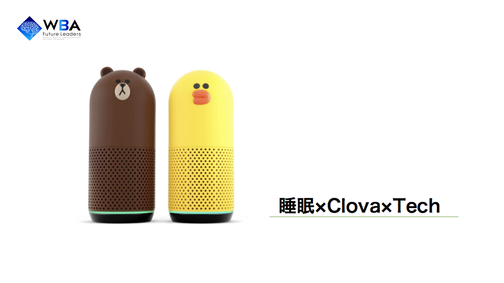

# サンプル（プロダクト名）

## 製品概要
### Sleeping Tech

### 背景
大学生として、日々の授業やレポート、サークルなどの活動をしていると「明日、レポートの提出になので、徹夜でレポートしないといけない」「明日、部活の遠征なので朝5時に起きないといけない」など、寝てはいけない/寝なけらばいけないことが多々あります。また、現代社会においては睡眠に関する問題は開発チームのような大学生だけでなく広く社会人一般にも当てはまる問題と言えるでしょう。
スマートフォンアプリストアで、睡眠に関するアプリを検索すると、数多くの目覚まし時計アプリなどがヒットします。しかし、既存の多くのスマートフォンアプリでは私たちの問題を解決できません。なぜならば、
- 睡眠アプリの多くは睡眠からの「めざめ」に注目しているが、私たちの課題は睡眠の前の段階にあるから
- スマートフォンの液晶から発せられるブルーライトは睡眠を妨げるから
そこで私たちは、スマートスピーカーを用いることで以上の二点を克服するためのスキルを作成することにした。

### 製品説明（具体的な製品の説明）
こちらに製品の概要・特徴について説明を記載してください。

### 特長

#### 1. 特長1

#### 2. 特長2

#### 3. 特長3

### 解決出来ること
この製品を利用することによって最終的に解決できることについて記載をしてください。

### 今後の展望
今回は実現できなかったが、今後改善すること、どのように展開していくことが可能かについて記載をしてください。

## 開発内容・開発技術
### 活用した技術
#### API・データ
今回スポンサーから提供されたAPI、製品などの外部技術があれば記述をして下さい。

* 
* 
* 

#### フレームワーク・ライブラリ・モジュール
* 
* 

#### デバイス
* 
* 

### 研究内容・事前開発プロダクト（任意）
ご自身やチームの研究内容や、事前に持ち込みをしたプロダクトがある場合は、こちらに実績なども含め記載をして下さい。

* 
* 

### 独自開発技術（Hack Dayで開発したもの）
#### 2日間に開発した独自の機能・技術
* 独自で開発したものの内容をこちらに記載してください
* 特に力を入れた部分をファイルリンク、またはcommit_idを記載してください（任意）
